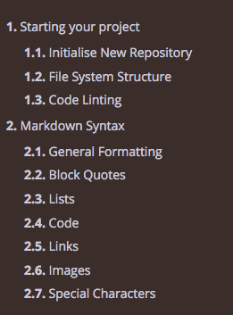

# File System Structure

The nice menu structure that mdBook renders is dependent on a file called
`SUMMARY.md`.  This repository is a bootstrap to make mdBook accessible to
the average user and it will build this summary file for you, but the trick
is you need to adhere to some basic rules to make this simple:

<!-- markdownlint-disable -->
1. The first folder for your markdown documentation after the base level of the repository must be `.src`
2. For every folder underneath `src` represents a tree branch.  Each branch must have a markdown file called `HEADER.md` which contains a header and, optionally a paragraph.
3. It is a good idea to name all your sub-folders with a numeric prefix to denote the order in which you want them to appear in the tree on the left-hand-side in the web view eg. `01.Introduction`
4. File and folder names may not contain spaces.  Use underscores, which will render as spaces in HTML published view.
5. Apart from the file `HEADER.md`, you need to write your documentation in `*.md*` files.  It is a good idea to name them with a numeric prefix to ensure they render in the order you want 
6. Aside from folders and files, you can have any other types of files in these folders to store images, etc.  Only folders and files suffixed with `*.md` will be built into the summary file.
<!-- markdownlint-restore -->

## Example

An example of how directory and file names will be rendered can be found from
this repository itself.  At the time of writing, this was the directory and
file structure and list:

```bash
src
    01.Starting_your_project/
         01.Inital_Clone.md
         02.File_Structure.md
         03.Linting.md
         HEADER.md
  10.Markdown
        01.General_Formatting.md
        02.Block_Quotes.md
        03.Lists.md
        04.Code.md
        05.Links.md
        06.Images.md
        07.Special_Characters.md
        HEADER.md
```

This is what the rendered book menu will look like.


